# 🚀 Guía para instalar NVM, Node.js, npm y Angular 19 en Windows


<style>
.code-card {
  margin: 1.35rem 0;
  border: 1px solid #d0d7de;
  border-radius: 10px;
  overflow: hidden;
  background: #f6f8fa;
  box-shadow: 0 2px 8px rgba(31, 35, 40, 0.08);
}
.code-card .code-label {
  display: inline-block;
  margin: 0;
  padding: 0.35rem 0.8rem;
  background: #111111;
  color: #ffffff;
  font-family: -apple-system, BlinkMacSystemFont, "Segoe UI", sans-serif;
  font-size: 0.72rem;
  font-weight: 700;
  letter-spacing: 0.08em;
  text-transform: uppercase;
  border-bottom-right-radius: 7px;
}
.code-card pre {
  margin: 0;
  padding: 1rem 1.15rem 1.15rem;
  overflow-x: auto;
  background: #f7fbf7;
  line-height: 1.55;
  tab-size: 2;
}
.code-card code {
  font-family: "Cascadia Code", "JetBrains Mono", Consolas, "Courier New", monospace;
  font-size: 0.92rem;
  color: #24292f;
  background: transparent;
  white-space: pre;
}
.code-card[data-lang="json"] pre { background: #f7f9fc; }
.code-card[data-lang="text"] pre { background: #fafafa; }
:not(pre) > code {
  padding: 0.12em 0.38em;
  border-radius: 4px;
  background: #eef1f4;
  color: #24292f;
  font-family: "Cascadia Code", "JetBrains Mono", Consolas, monospace;
  font-size: 0.92em;
}
figure.guide-figure {
  margin: 1.4rem auto;
  text-align: center;
}
figure.guide-figure img {
  max-width: 100%;
  height: auto;
  border: 1px solid #d0d7de;
  border-radius: 8px;
  box-shadow: 0 2px 8px rgba(31, 35, 40, 0.10);
}
figure.guide-figure figcaption {
  margin-top: 0.45rem;
  color: #57606a;
  font-size: 0.88rem;
}
</style>


> **Objetivo:** preparar un entorno homogéneo de desarrollo Angular 19 en Windows utilizando NVM for Windows, Node.js 22, npm y Angular CLI 19.

---

## 🧭 Entorno que utilizaremos

```text
NVM for Windows
│
└── Node.js 22
    │
    ├── npm
    │
    └── Angular CLI 19
        │
        └── Aplicaciones Angular 19
```

Durante el curso utilizaremos:

- **NVM for Windows**
- **Última versión disponible de Node.js 22**
- **npm**, incluido con Node.js
- **Angular 19**
- **Angular CLI 19**
- **Visual Studio Code**

### Combinación recomendada

```text
Node.js 22
Angular 19
Angular CLI 19
```

---

# 1. Instalar NVM for Windows

NVM permite instalar y utilizar diferentes versiones de Node.js en un mismo ordenador.

En Windows utilizaremos **NVM for Windows**.

Repositorio oficial:

<https://github.com/coreybutler/nvm-windows>

Accedemos al apartado **Releases** y descargamos:

`nvm-setup.exe`


<figure class="guide-figure">
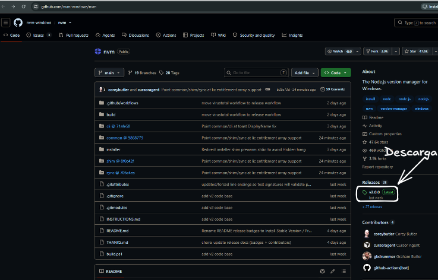
<figcaption>Repositorio de NVM for Windows y acceso a Releases.</figcaption>
</figure>

<figure class="guide-figure">
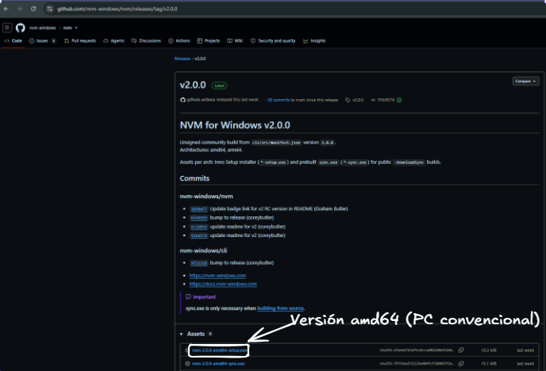
<figcaption>Descarga del instalador para arquitectura amd64.</figcaption>
</figure>


Ejecutamos el instalador y aceptamos las opciones propuestas.


<figure class="guide-figure">
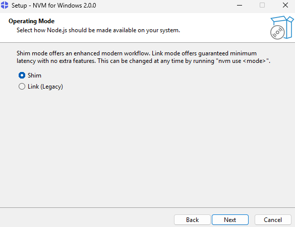
<figcaption>Selección del modo de funcionamiento durante la instalación.</figcaption>
</figure>


> ❓ **Pregunta**  
> ¿Puedes indicar cuál es la diferencia entre **Shim** y **Link** en el modo de instalación de `nvm-windows`?


<figure class="guide-figure">
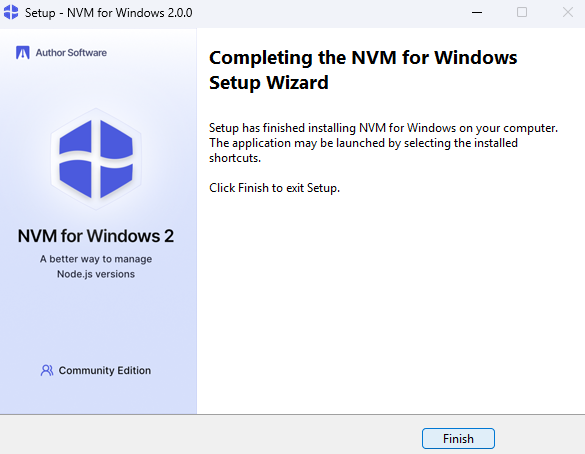
<figcaption>Finalización del asistente de instalación.</figcaption>
</figure>


Al finalizar, cerramos las terminales abiertas y abrimos una nueva:

- Windows Terminal
- PowerShell
- CMD

Comprobamos la instalación:


<div class="code-card" data-lang="bash">
<div class="code-label">TERMINAL / POWERSHELL</div>
<pre><code class="language-bash">nvm --version</code></pre>
</div>

<figure class="guide-figure">
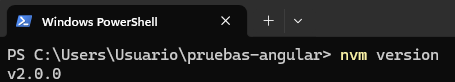
<figcaption>Comprobación de la versión instalada de NVM.</figcaption>
</figure>


---

# 2. Consultar las versiones de Node.js disponibles

Podemos consultar las versiones disponibles mediante:


<div class="code-card" data-lang="bash">
<div class="code-label">TERMINAL / POWERSHELL</div>
<pre><code class="language-bash">nvm list available --no-limit</code></pre>
</div>


Para este curso utilizaremos:

> **Node.js 22.x**, en concreto en la guía: **v22.23.2**

Aunque existan versiones posteriores, mantendremos **Node.js 22** para disponer de un entorno homogéneo y compatible con Angular 19.


<figure class="guide-figure">
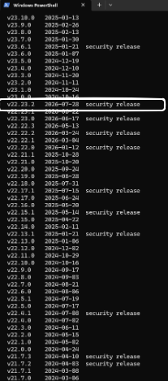
<figcaption>Listado de versiones de Node.js disponibles, destacando la rama 22.</figcaption>
</figure>


---

# 3. Instalar la última versión disponible de Node.js 22

Ejecutamos:


<div class="code-card" data-lang="bash">
<div class="code-label">TERMINAL / POWERSHELL</div>
<pre><code class="language-bash">nvm install 22</code></pre>
</div>


NVM instalará la versión más reciente disponible perteneciente a la rama 22.


<figure class="guide-figure">
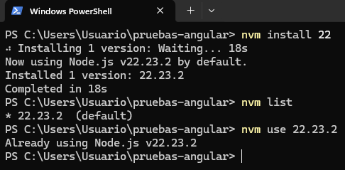
<figcaption>Instalación, listado y activación de Node.js 22 con NVM.</figcaption>
</figure>


---

# 4. Activar Node.js 22

Una vez instalado:


<div class="code-card" data-lang="bash">
<div class="code-label">TERMINAL / POWERSHELL</div>
<pre><code class="language-bash">nvm use 22</code></pre>
</div>


Comprobamos:


<div class="code-card" data-lang="bash">
<div class="code-label">TERMINAL / POWERSHELL</div>
<pre><code class="language-bash">node -v</code></pre>
</div>


El resultado será similar a:


<div class="code-card" data-lang="text">
<div class="code-label">SALIDA / TEXTO</div>
<pre><code class="language-text">v22.x.x</code></pre>
</div>


También podemos consultar las versiones instaladas:


<div class="code-card" data-lang="bash">
<div class="code-label">TERMINAL / POWERSHELL</div>
<pre><code class="language-bash">nvm list</code></pre>
</div>


---

# 5. Comprobar npm

`npm` se instala automáticamente junto con Node.js.

No es necesario instalarlo por separado.

Comprobamos:


<div class="code-card" data-lang="bash">
<div class="code-label">TERMINAL / POWERSHELL</div>
<pre><code class="language-bash">npm -v</code></pre>
</div>

<figure class="guide-figure">
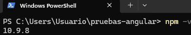
<figcaption>Versión de npm incluida con Node.js.</figcaption>
</figure>


También podemos comprobar las rutas utilizadas:


<div class="code-card" data-lang="bash">
<div class="code-label">TERMINAL / POWERSHELL</div>
<pre><code class="language-bash">where.exe node
where.exe npm</code></pre>
</div>

<figure class="guide-figure">
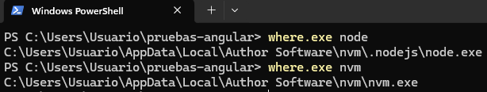
<figcaption>Rutas empleadas por Node.js y NVM.</figcaption>
</figure>


---

# 6. Comprobación inicial

Ejecutamos:


<div class="code-card" data-lang="bash">
<div class="code-label">TERMINAL / POWERSHELL</div>
<pre><code class="language-bash">nvm --version
node --version
npm --version</code></pre>
</div>


Deberíamos obtener aproximadamente:

```text
NVM:  versión instalada
Node: v22.x.x
npm:  versión incluida con Node.js
```

---

# 7. Angular CLI: instalación global y local

Angular CLI puede instalarse de dos formas:

```text
Instalación global
        +
Instalación local en cada proyecto
```

Ambas instalaciones tienen objetivos diferentes.

## 7.1. Instalación global

La instalación global permite utilizar el comando `ng` desde cualquier directorio.

Para instalar Angular CLI 19 globalmente:


<div class="code-card" data-lang="bash">
<div class="code-label">TERMINAL / POWERSHELL</div>
<pre><code class="language-bash">npm install -g @angular/cli@19</code></pre>
</div>


El modificador:

- `-g` significa **global**.
- `@19` indica que queremos utilizar **Angular CLI 19**.

Comprobamos:


<div class="code-card" data-lang="bash">
<div class="code-label">TERMINAL / POWERSHELL</div>
<pre><code class="language-bash">ng version</code></pre>
</div>


La instalación global resulta cómoda para:

- crear nuevos proyectos;
- ejecutar comandos Angular desde cualquier directorio;
- disponer de `ng` directamente en la terminal.

En algunos casos con `nvm-windows` puede ser necesario forzar un **reshim**.


<figure class="guide-figure">
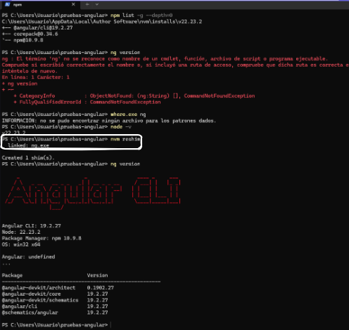
<figcaption>Ejemplo de instalación global y actualización del shim antes de ejecutar Angular CLI.</figcaption>
</figure>


---

# 8. Recomendación: instalación local de Angular CLI

Además de la instalación global, se recomienda que cada proyecto disponga de su propia versión local de Angular CLI.

Esto permite que la versión quede asociada al proyecto.

Dentro de un proyecto podemos instalar Angular CLI 19 como dependencia de desarrollo:


<div class="code-card" data-lang="bash">
<div class="code-label">TERMINAL / POWERSHELL</div>
<pre><code class="language-bash">npm install --save-dev @angular/cli@19</code></pre>
</div>


También puede utilizarse la forma abreviada:


<div class="code-card" data-lang="bash">
<div class="code-label">TERMINAL / POWERSHELL</div>
<pre><code class="language-bash">npm install -D @angular/cli@19</code></pre>
</div>


La opción:

- `-D` equivale a `--save-dev`.

Angular CLI aparecerá dentro de `devDependencies` en `package.json`.

Por ejemplo:


<div class="code-card" data-lang="json">
<div class="code-label">JSON</div>
<pre><code class="language-json">{
  "devDependencies": {
    "@angular/cli": "^19.2.0"
  }
}</code></pre>
</div>

<figure class="guide-figure">
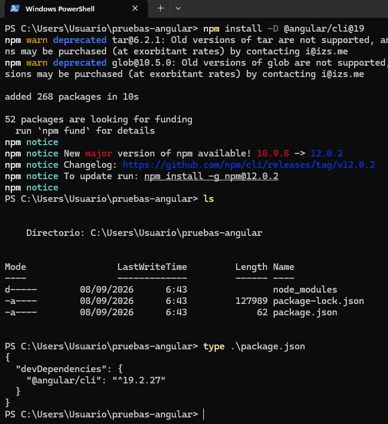
<figcaption>Instalación local de Angular CLI y comprobación en package.json.</figcaption>
</figure>


De esta forma, la versión de Angular CLI forma parte de la configuración del propio proyecto.

---

# 9. ¿Por qué recomendamos Angular CLI local?

La instalación local presenta varias ventajas importantes.

## 9.1. Misma versión para todos

Todos los alumnos que descarguen el proyecto utilizarán la versión de Angular CLI especificada en `package.json`.

Esto evita situaciones como:

```text
Alumno A → Angular CLI 19
Alumno B → Angular CLI 20
Alumno C → Angular CLI 22
```

## 9.2. Reproducibilidad

Cuando otro desarrollador descarga el proyecto y ejecuta:


<div class="code-card" data-lang="bash">
<div class="code-label">TERMINAL / POWERSHELL</div>
<pre><code class="language-bash">npm install</code></pre>
</div>


npm instalará automáticamente la versión de Angular CLI definida por el proyecto.

Por tanto:

```text
package.json
     +
package-lock.json
     ↓
entorno reproducible
```

## 9.3. Independencia de la instalación global

Cada proyecto puede utilizar una versión diferente:

```text
proyecto-angular-19
└── Angular CLI 19

proyecto-angular-20
└── Angular CLI 20
```

aunque ambos estén en el mismo ordenador.

---

# 10. Ejecutar Angular CLI local con `npx`

Para ejecutar expresamente la versión local instalada en el proyecto:


<div class="code-card" data-lang="bash">
<div class="code-label">TERMINAL / POWERSHELL</div>
<pre><code class="language-bash">npx ng version</code></pre>
</div>


En lugar de:


<div class="code-card" data-lang="bash">
<div class="code-label">TERMINAL / POWERSHELL</div>
<pre><code class="language-bash">ng version</code></pre>
</div>


`npx` busca primero el ejecutable instalado dentro del proyecto:

`node_modules/.bin`


<figure class="guide-figure">
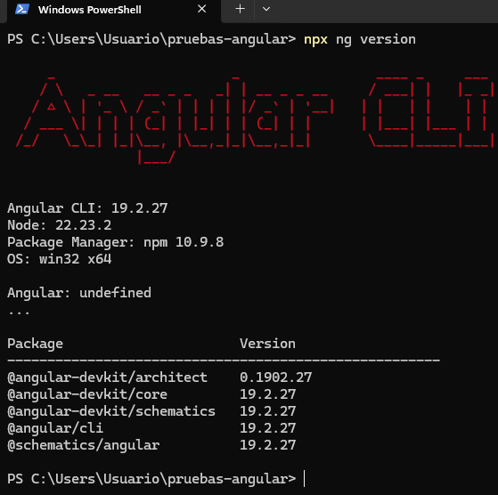
<figcaption>Ejecución de Angular CLI local con npx.</figcaption>
</figure>


Por tanto:


<div class="code-card" data-lang="bash">
<div class="code-label">TERMINAL / POWERSHELL</div>
<pre><code class="language-bash">npx ng serve</code></pre>
</div>


ejecutará la versión de Angular CLI asociada al proyecto.

También podemos utilizar:


<div class="code-card" data-lang="bash">
<div class="code-label">TERMINAL / POWERSHELL</div>
<pre><code class="language-bash">npx ng generate component ejemplo
npx ng build</code></pre>
</div>


---

# 11. Recomendación para el curso

Durante el curso utilizaremos las dos modalidades.

## Instalación global

En cada ordenador:


<div class="code-card" data-lang="bash">
<div class="code-label">TERMINAL / POWERSHELL</div>
<pre><code class="language-bash">npm install -g @angular/cli@19</code></pre>
</div>


Esto permite utilizar cómodamente `ng` desde cualquier ubicación.

## Instalación local

Cada proyecto deberá tener Angular CLI incluido en sus dependencias de desarrollo:


<div class="code-card" data-lang="bash">
<div class="code-label">TERMINAL / POWERSHELL</div>
<pre><code class="language-bash">npm install -D @angular/cli@19</code></pre>
</div>


> ✅ **Recomendación del curso**  
> Instalar Angular CLI 19 globalmente para disponer del comando `ng`, pero mantener también Angular CLI como dependencia local de cada proyecto.  
> **La versión local será la referencia principal del proyecto.**

---

# 12. Global frente a local

| Modalidad | Comando | Utilidad |
|---|---|---|
| Global | `npm install -g @angular/cli@19` | Permite utilizar `ng` desde cualquier directorio |
| Local | `npm install -D @angular/cli@19` | Fija la versión utilizada por el proyecto |
| Ejecutar global | `ng serve` | Utiliza el comando disponible globalmente |
| Ejecutar local | `npx ng serve` | Utiliza Angular CLI instalado en el proyecto |

Para proyectos compartidos, ejercicios y prácticas del curso se recomienda preferentemente:

`npx ng ...`

cuando queramos garantizar que se utiliza exactamente la versión local.

---

# 13. Crear un nuevo proyecto Angular 19

Después de instalar Angular CLI globalmente:


<div class="code-card" data-lang="bash">
<div class="code-label">TERMINAL / POWERSHELL</div>
<pre><code class="language-bash">npm install -g @angular/cli@19</code></pre>
</div>


Creamos una carpeta:


<div class="code-card" data-lang="bash">
<div class="code-label">TERMINAL / POWERSHELL</div>
<pre><code class="language-bash">mkdir proyectos-angular
cd proyectos-angular</code></pre>
</div>


Creamos la aplicación:


<div class="code-card" data-lang="bash">
<div class="code-label">TERMINAL / POWERSHELL</div>
<pre><code class="language-bash">ng new mi-primera-app</code></pre>
</div>

<figure class="guide-figure">
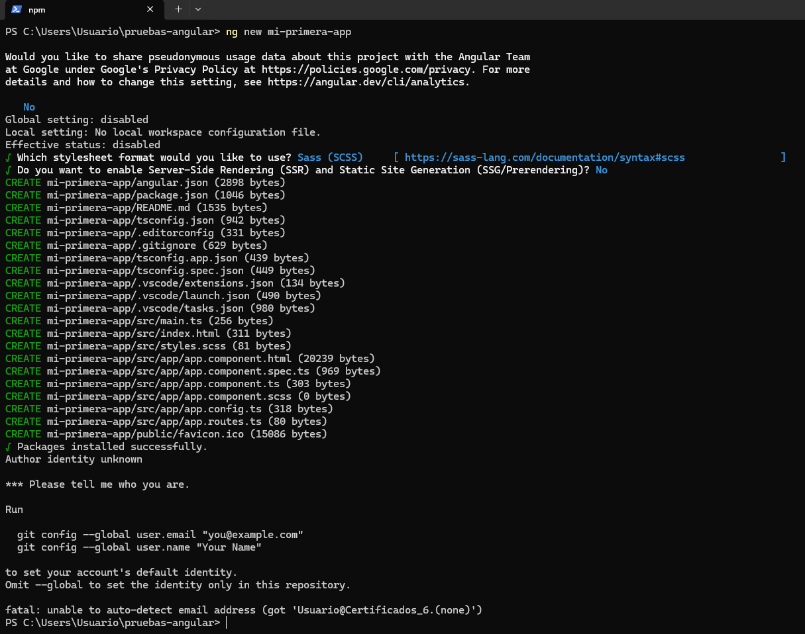
<figcaption>Creación de una nueva aplicación Angular 19 con Angular CLI.</figcaption>
</figure>


> ❓ **Pregunta**  
> ¿Qué diferencia hay entre **Sass** y **Sass indented**?

Entramos en el proyecto:


<div class="code-card" data-lang="bash">
<div class="code-label">TERMINAL / POWERSHELL</div>
<pre><code class="language-bash">cd mi-primera-app</code></pre>
</div>


Los proyectos generados por Angular CLI ya incluyen normalmente `@angular/cli` dentro de sus dependencias de desarrollo.

Podemos comprobarlo en `package.json` o ejecutar:


<div class="code-card" data-lang="bash">
<div class="code-label">TERMINAL / POWERSHELL</div>
<pre><code class="language-bash">npm list @angular/cli</code></pre>
</div>


---

# 14. Comprobar la versión local

Dentro del proyecto ejecutamos:


<div class="code-card" data-lang="bash">
<div class="code-label">TERMINAL / POWERSHELL</div>
<pre><code class="language-bash">npx ng version</code></pre>
</div>


Deberíamos obtener información similar a:

```text
Angular CLI: 19.x
Angular: 19.x
Node: 22.x
Package Manager: npm
OS: win32 x64
```

También podemos consultar directamente:


<div class="code-card" data-lang="bash">
<div class="code-label">TERMINAL / POWERSHELL</div>
<pre><code class="language-bash">npm list @angular/cli</code></pre>
</div>


---

# 15. Ejecutar la aplicación

Desde el directorio del proyecto podemos utilizar:


<div class="code-card" data-lang="bash">
<div class="code-label">TERMINAL / POWERSHELL</div>
<pre><code class="language-bash">ng serve</code></pre>
</div>


o, preferentemente cuando queramos garantizar que se utiliza la versión local:


<div class="code-card" data-lang="bash">
<div class="code-label">TERMINAL / POWERSHELL</div>
<pre><code class="language-bash">npx ng serve</code></pre>
</div>


Para abrir automáticamente el navegador:


<div class="code-card" data-lang="bash">
<div class="code-label">TERMINAL / POWERSHELL</div>
<pre><code class="language-bash">npx ng serve -o</code></pre>
</div>


La aplicación estará normalmente disponible en:

<http://localhost:4200>

---

# 16. Posible problema con PowerShell

En algunos equipos puede aparecer:


<div class="code-card" data-lang="text">
<div class="code-label">ERROR / POWERSHELL</div>
<pre><code class="language-text">npm.ps1 cannot be loaded because running scripts is disabled</code></pre>
</div>


Podemos solucionarlo ejecutando:


<div class="code-card" data-lang="bash">
<div class="code-label">TERMINAL / POWERSHELL</div>
<pre><code class="language-bash">Set-ExecutionPolicy -Scope CurrentUser -ExecutionPolicy RemoteSigned</code></pre>
</div>


Confirmamos el cambio y volvemos a abrir PowerShell.

También podemos utilizar **CMD** como alternativa.

---

# 17. Secuencia completa de instalación del entorno

## Instalar Node.js


<div class="code-card" data-lang="bash">
<div class="code-label">TERMINAL / POWERSHELL</div>
<pre><code class="language-bash">nvm install 22
nvm use 22</code></pre>
</div>


Comprobamos:


<div class="code-card" data-lang="bash">
<div class="code-label">TERMINAL / POWERSHELL</div>
<pre><code class="language-bash">node -v
npm -v</code></pre>
</div>


## Instalar Angular CLI globalmente


<div class="code-card" data-lang="bash">
<div class="code-label">TERMINAL / POWERSHELL</div>
<pre><code class="language-bash">npm install -g @angular/cli@19</code></pre>
</div>


Comprobamos:


<div class="code-card" data-lang="bash">
<div class="code-label">TERMINAL / POWERSHELL</div>
<pre><code class="language-bash">ng version</code></pre>
</div>


---

# 18. Secuencia recomendada dentro de un proyecto

Creamos el proyecto:


<div class="code-card" data-lang="bash">
<div class="code-label">TERMINAL / POWERSHELL</div>
<pre><code class="language-bash">ng new mi-primera-app</code></pre>
</div>


Entramos:


<div class="code-card" data-lang="bash">
<div class="code-label">TERMINAL / POWERSHELL</div>
<pre><code class="language-bash">cd mi-primera-app</code></pre>
</div>


Comprobamos la versión local:


<div class="code-card" data-lang="bash">
<div class="code-label">TERMINAL / POWERSHELL</div>
<pre><code class="language-bash">npm list @angular/cli</code></pre>
</div>


Ejecutamos Angular utilizando la versión local:


<div class="code-card" data-lang="bash">
<div class="code-label">TERMINAL / POWERSHELL</div>
<pre><code class="language-bash">npx ng version</code></pre>
</div>


Arrancamos el proyecto:


<div class="code-card" data-lang="bash">
<div class="code-label">TERMINAL / POWERSHELL</div>
<pre><code class="language-bash">npx ng serve -o</code></pre>
</div>


Si trabajamos sobre un proyecto existente descargado de Git:


<div class="code-card" data-lang="bash">
<div class="code-label">TERMINAL / POWERSHELL</div>
<pre><code class="language-bash">npm install
npx ng serve</code></pre>
</div>


No será necesario instalar manualmente Angular CLI local si ya aparece como dependencia en `package.json`.

---

# 19. Configuración recomendada para el aula

| Herramienta | Versión recomendada |
|---|---|
| Sistema operativo | Windows 10/11 64 bits |
| NVM | Última versión disponible |
| Node.js | Última versión 22.x disponible |
| npm | Incluido con Node.js |
| Angular | 19.x |
| Angular CLI global | 19.x |
| Angular CLI local | 19.x en cada proyecto |
| Editor | Visual Studio Code |
| Navegador | Chrome / Edge / Firefox |

La configuración recomendada será:

```text
Windows
│
└── NVM
    │
    └── Node.js 22
        │
        └── npm
            │
            ├── Angular CLI 19 global
            │
            └── proyecto
                │
                └── Angular CLI 19 local
```

---

# 20. Criterio que utilizaremos durante el curso

Seguiremos estas tres reglas:

1. **Node.js 22** será la rama utilizada por todos los equipos.
2. Instalaremos **Angular CLI 19 globalmente**:


<div class="code-card" data-lang="bash">
<div class="code-label">TERMINAL / POWERSHELL</div>
<pre><code class="language-bash">npm install -g @angular/cli@19</code></pre>
</div>


3. Cada proyecto mantendrá también su propia versión local de Angular CLI:


<div class="code-card" data-lang="bash">
<div class="code-label">TERMINAL / POWERSHELL</div>
<pre><code class="language-bash">npm install -D @angular/cli@19</code></pre>
</div>


Cuando el proyecto ya tenga Angular CLI declarado en `package.json`, bastará con:


<div class="code-card" data-lang="bash">
<div class="code-label">TERMINAL / POWERSHELL</div>
<pre><code class="language-bash">npm install</code></pre>
</div>


La recomendación para ejecutar comandos dentro de proyectos será:


<div class="code-card" data-lang="bash">
<div class="code-label">TERMINAL / POWERSHELL</div>
<pre><code class="language-bash">npx ng serve
npx ng build
npx ng test
npx ng generate component productos</code></pre>
</div>


Así nos aseguramos de utilizar la versión de Angular CLI definida por el proyecto, independientemente de la versión global instalada en el ordenador.

---

# 21. Comprobación final

Antes de comenzar a trabajar:


<div class="code-card" data-lang="bash">
<div class="code-label">TERMINAL / POWERSHELL</div>
<pre><code class="language-bash">nvm list
node -v
npm -v
ng version</code></pre>
</div>


Dentro de un proyecto:


<div class="code-card" data-lang="bash">
<div class="code-label">TERMINAL / POWERSHELL</div>
<pre><code class="language-bash">npm list @angular/cli
npx ng version</code></pre>
</div>


El entorno deberá quedar aproximadamente así:

```text
Node.js:              22.x
npm:                  versión incluida con Node.js
Angular:              19.x
Angular CLI global:   19.x
Angular CLI local:    19.x
```

> ✅ **Recomendación final del curso**  
> Angular CLI global facilita el trabajo desde la terminal, pero **la versión local del proyecto es la que debe considerarse como referencia** para asegurar que todos los desarrolladores utilizan el mismo entorno.

